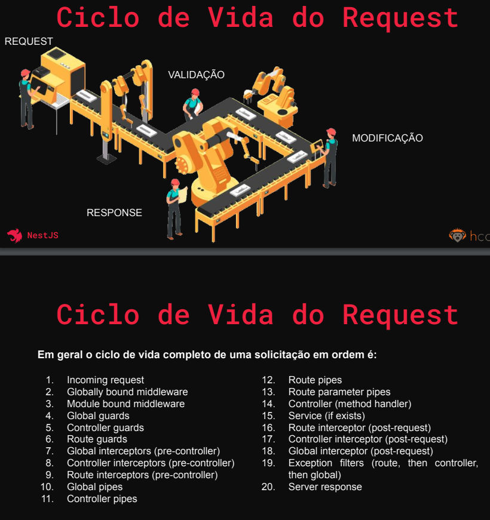

https://docs.nestjs.com/

# Passo a passo

Fazer videos pequenos, separados por modulos, para que seja mais facil editar, e encontrar mais pessoas que estejam interessadas apenas naquela topico especifico:

- explicar nivel de conhecimento necessario para o curso (intermediario - ja fez api express?)
- explicar o porque de usar as tecnologias escolhidas (full open source)
npm i -g @nestjs/cli
nest new project-name
- demonstrar estrutura de pastas e main.ts (approot)
- fornecer meu README.md para o usuario consultar quando quiser se tiver duvidas durante e apos o curso
- explicar como subir um docker compose do postgres e qual poder nos da
- explicar como conecta-lo no azure data studio
- instalar prisma e configurar nosso banco
  - criar um schema prisma basico para user
  - modificar URL_DATABASE no .env para conectar ao nosso banco
  - instalar @nestjs/config, e adicionar no appModule o import ConfigModule.forRoot()
  - demonstrar com o hello.world o porque precisa dele pro .env
- criar entidade user usando comandos do cli
  nest g mo user
  nest g co user
  nest g s user
  - criar o user-dto e seguir explicando de acordo com arquivo, instalar pacotes
    npm i class-transformer class-validator
    - mostrar na documentacao nest os validadores possiveis e explicar como funcionam os que implementaremos
  - criar servico explicando o que é um construtor injetando o PrismaService e bcrypt pra senha.

# Migrations com Prisma

Toda vez que voce fizer uma alteracao no banco de dados, voce pode usar o prisma db push,
mas ele nao ira criar uma migration (salvar um backup do banco de dados com as alteracoes caso precise reverter)
Portanto, acostume-se com o comando abaixo e entenda que ele é uma boa pratica, assim como fazer um commit bem feito com git.

npx prisma migrate dev --name migrationInicial

# Nest CLI
nest g mo user
nest g s user
nest g co user

# CURSO NEST.JS FUNDAMENTOS DA UDEMY

npm i --force
docker compose up -d
npx prisma db push
npx prisma generate
npm run dev

Ir no postman e bater na rota http://localhost:8000/auth/register com verbo POST para registrar um user :
{
"name": "Fulano",
"email": "fulano@gmail.com",
"password": "Gow@1234"
}

Agora voce ja pode bater na hora de login, e capturar seu token para poder usar no body das requisicoes:
Batendo na rota http://localhost:8000/auth/login com verbo POST, passando o login do usuario:
{
"email": "anso@gmail.com",
"password": "Gow@2020"
}
você ira receber como resposta o objeto { "accessToken": "SEU TOKEN JWT" }

Bata na rota http://localhost:8000/users com verbo GET, passando o bearer token capturado no login para testar

---

LINK DE OPCOES DE VALIDACAO DO CLASS-VALIDATOR:
https://github.com/typestack/class-validator#validation-decorators

ENTENDENDO A ESTRTUTURA DE PASTAS:
O Nest.js utiliza por padrao a arquitura MVC (Model-View-Controller)

Fazendo uma comparacao do Nest com um restaurante, vamos explicar cada um:

Main.ts: É onde fica a abstracao global da aplicacao. Tudo que se quiser importar para a aplicacao por inteiro, deve-se ser importado aqui. (Middlewares globais)

Modules: Representa o Restaurante como um todo, e sua gerência. Os modulos que sao responsaveis por unir/comunicar/organizar (Controllers + Services + Importacoes, Exportacoes, etc)

Controllers: É como se fosse o garcom do restaurante, responsavel por receber os pedidos do cliente, e encaminha-los à cozinha, e quando o prato estiver pronto, retornar ao cliente.

Services: É o CHEF DA COZINHA do restaurante, responsavel por criar, modificar, alterar, cadastrar, efim, lidar com a parte criativa das regras de negocio dos dados recebidos. Caso os servicos fiquem muito grandes, podemos ainda sub-dividir em mais uma camada, chamada de...

UseCases: Sāo como se fossem os funcionarios do CHEF da cozinha. Sao as subdivisoes de pequenos servicos, para facilitar a manutencao e entendimento e organizacao dos Services, dividindo o tratamento dos dados e das regras de negocio em pequenas tarefas.

# Docker Postgres - COMO INICIALIZAR O BANCO DE DADOS

https://www.youtube.com/watch?v=gnq8ZY85UUM
docker exec -it CONTAINER_NAME bash (entra no prompt de console da imagem - opcional)

- crie um schema prisma padrao, mude o env e pastas
  docker compose up -d
- npx prisma db push
  OBS: Caso precise reiniciar a imagem, deve-se fazer um novo PRISMA DB PUSH / GENERATE pois obviamente o banco vai comecar vazio:
  - mudar a porta, e nome do db para nao ter conflito nos arquivos docker-compose.yml e .env e fazer um prisma db push + prisma generate depois

### CorsAnywhere personal proxy

https://web-production-5e1b.up.railway.app/

# Instrucoes para producao

pm2 start server.js
pm2 start "node server.js"
pm2 list
pm2 stop all / pm2 start all / pm2 restart all
pm2 delete 0
pm2 monit
pm2 show 0
pm2 start -i max server.js
pm2 startup
pm2 save

sudo systemctl restart nginx

- Caso de erro ao dar restart no nginx, use os comandos abaixo, onde PROCESS_ID eh o numero do processo que esta rodando na porta 80, geralmente, o Apache:
  sudo netstat -tulpn | grep :80
  sudo kill PROCESS_ID

---

# Dicas avancadas EXPRESS + PRISMA:

Caso de erro na rota, tente os seguintes passos: - Verifique se vc colocou 2 rotas com o mesmo endpoint recebendo dados: Se vc ja tem uma rota /user/:wallet, nao pode colocar outra /user/:id - Verifique se o parametro que vc esta recebendo foi convertido para o type correspondente no schema.prisma. um ID por exemplo deve ser convertido para inteiro. - Update e Delete parecem so funcionar com o ID padrao do prisma - Nao se esqueca de mudar o arquivo de rotas caso mude algum tipo (:id) ou o path da rota

# Configurar Prisma e rotas de API:

0 - Comando para fazer backup do DB (Migration)
npx prisma migrate dev --name init
npx prisma migrate dev --name add_teste_table

1 - Criar uma pasta e arquivo schema padrao. Mudar a URL do banco dentro do schema padrao criado.
npx prisma init

2 - Para dar um pull no banco de dados em cloud existente passado pela variavel de ambiente URL*DB:
npx prisma db pull
DICA* Para enviar para o Atlas qualquer modificacao do schema, basta dar um "npx prisma db push" e depois um "npx prisma generate"

3 - Gerar client que sera importado no app para ler e escrever no banco:
npx prisma generate

5 - importar client em um controller:
import { PrismaClient } from '@prisma/client'
const prisma = new PrismaClient()

4 - Ao adicionar algum campo ou tabela no schema, fazer migrate com o comando abaixo:
npx prisma migrate dev

# Instrucoes detalhadas para CRUD com Express.js + Mongoose + MongoDB

### Para adicionar uma nova entidade:

1 - Criar um model no arquivo schema.prisma no diretorio Prisma.

2 - Criar um controller.

3 - Criar um route.

4 - Adicionar a nova rota em index.js dentro de routes

-----------x-----------x-----------x-----------x-----------

5 - Para adicionar referencia/relacionamento, fazer como no schema de livros:
autor: {type: mongoose.Schema.Types.ObjectId, ref: 'autores', required: true},

6 - Fazer o populate do autor dentro dos controladores do livro:
static listarLivros = (req, res) => {
livros.find()
.populate('autor')
.exec((err, livros) => {
res.status(200).json(livros)
})
}

7 - Quando cadastrar um livro, passar o ID do autor na hora de cadastrar o mesmo que o banco ira fazer a referencia.

-----------x-----------x-----------x-----------x-----------

8 - Fazer consulta especifica:
static listarLivroPorEditora = (req, res) => {
const editora = req.query.editora; // O endpoint tera 'editora' ao fazer a consulta no postman.
livros.find({'editora': editora}, {}, (err, livros) => {
res.status(200).send(livros);
})
}

9 - Adicionar na rota de livros a linha antes da consulta de livros por ID:
.get('/livros/busca', LivroController.listarLivroPorEditora)

10 - Ao fazer a busca pelo postman, usar o seguinte endpoint:
http://localhost:3000/livros/busca?editora=alura

    XXXXXXXXXXXXXXXXXXXXXXXXXXXXXXXXXXXXXXXXXXXXXXXXXXXXXXXXXXXXXXXXXXXXXXXXXXXXXXXXXXXX

# Libs do node.js secundarias utilizadas e quais suas aplicacoes:

nodemailer + @nestjs-modules/mailer -> manipulacao de emails
Express.Multer -> manipulacao de arquivos em geral em rotas
@nestjs/jwt -> manipulacao de token JWT nas rotas
@nestjs/throttler -> Previnir ataques DDOS limitando os acessos por segundo, e outros.
rxjs -> Lida com acionamento de eventos no DOM de forma reativa
class-validator -> Lida com validacoes diversas, como @isEmail, @isStrongPassword, etc
lodash -> Manipula array, e gera filtragens avancadas ja prontas.
moment -> Manipula datas de uma maneira bem mais intuitiva e melhor leitura que o modo nativo
zod -> validacoes em geral
